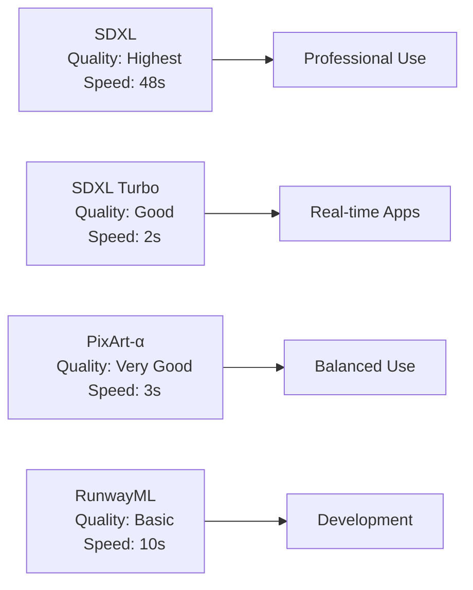
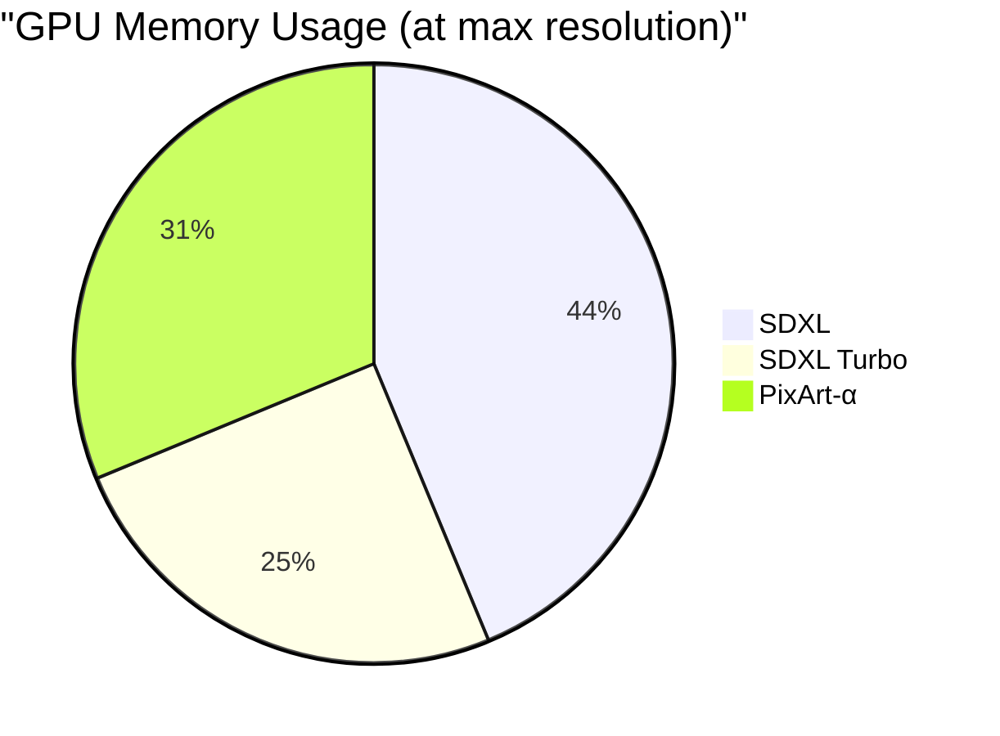
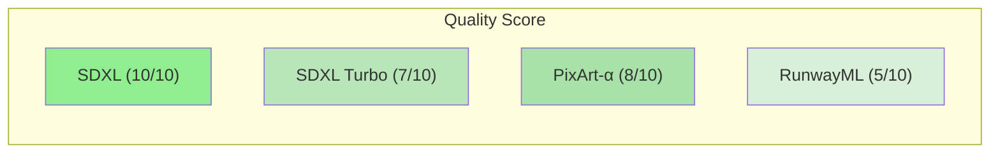
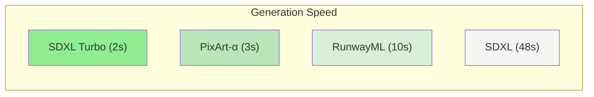
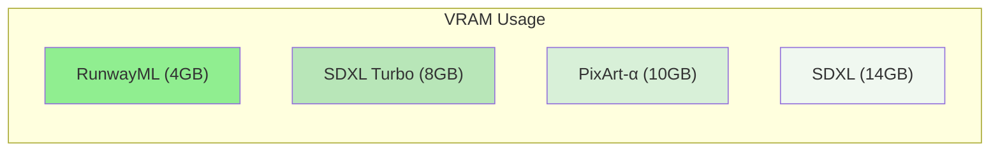

# AI Image Generation Models - A Performance Analysis

The landscape of AI image generation has evolved rapidly, with multiple open-source models now offering varying trade-offs between quality, speed, and resource requirements. This comprehensive analysis examines the performance characteristics and optimal configurations of leading models, based on extensive testing conducted using the [ImageGenAI](https://github.com/raunakkathuria/imagegenai). 

Whether you're building real-time applications, creating professional content, or working with limited computational resources, this guide will help you choose the right model for your specific needs.

## Key Findings

Here are the best results achieved with each model at their optimal settings:

| SDXL - [stabilityai/stable-diffusion-xl-base-1.0](https://huggingface.co/stabilityai/stable-diffusion-xl-base-1.0) | SDXL Turbo - [stabilityai/sdxl-turbo](https://huggingface.co/stabilityai/sdxl-turbo) | PixArt - [PixArt-alpha/PixArt-LCM](https://huggingface.co/spaces/PixArt-alpha/PixArt-LCM) |
|-----------|------------|--------------|
|  |  |  |
| Highest detail and photorealism, ideal for professional work (11-50 seconds generation) | Excellent quality with remarkable speed (1-2 seconds generation) | Artistic style with efficient performance (3 seconds generation) |
| Steps: 50 | Steps: 4 | Steps: 4 |
| Guidance: 7.5 | Guidance: 2.0 | Guidance: 2.0 |
| Size: 1024x1024 | Size: 768x768 | Size: 768x768 |
| Time: 48seconds | Time: 1-2seconds | Time: 3seconds |

## Test Environment

All the performance metrics were measured on an AWS `g4dn.xlarge` instance with the following specifications:

| GPU                                   | CPU     | RAM    |
| ------------------------------------- | ------- | ------ |
| NVIDIA T4 Tensor Core GPU (16GB VRAM) | 4 vCPUs | 16 GiB |

All reported generation times and memory usage metrics are based on this hardware configuration

## Methodology 

Our analysis focused on three key metrics: image quality, generation speed, and resource utilization. Each model was tested using identical prompts across multiple runs to ensure consistent benchmarking. Quality assessments combine both objective metrics and subjective evaluation of image coherence and detail.

### Model Characteristics

| Model | Optimized For | Best Resolution | Generation Time | Key Feature |
|-------|---------------|-----------------|-----------------|-------------|
| SDXL | Quality | 1024x1024 | 48s | Professional results |
| SDXL Turbo | Speed | 768x768 | 1-2s | Real-time generation |
| PixArt-α | Balance | 768x768 | 3s | Artistic quality |
| RunwayML | CPU Use | 512x512 | 10s | No GPU required |

### Optimal Parameters

| Model | Steps | Guidance Scale | Use Case |
|-------|-------|----------------|-----------|
| SDXL | 50 | 7.5 | High-detail professional work |
| SDXL Turbo | 4 | 2.0 | Rapid prototyping, real-time |
| PixArt-α | 4 | 1.0-2.0 | General purpose, artistic |
| RunwayML | 50 | 7.5 | Development, testing |

## Model Trade-off Analysis

The following visualizations demonstrate the key performance trade-offs between quality, speed, and resource requirements - three critical factors in choosing the right model for your use case:

### Speed vs Quality Trade-offs

The following chart shows the relationship between generation time and output quality for each model:

Model Performance Summary:
- SDXL: Optimized for quality, best for professional work but slowest 
- SDXL Turbo: Optimized for speed, excellent for real-time with good quality
- PixArt-α: Balanced performance, suitable for most use cases with high quality
- RunwayML: CPU-capable, suitable for development, moderate speed and quality

### Resource Requirements

#### Memory Usage Distribution (16GB VRAM)

#### Performance Characteristics

1. Quality Comparison (1-10 scale)

2. Speed Comparison (Generation Time)

3. Memory Usage (GB VRAM)

> Darker green indicates better performance in each category

## Use Case Scenarios

- Content Creation Platforms: SDXL - Where consistent, high-quality outputs justify longer generation times
- Interactive Applications: SDXL Turbo - When sub-second generation is crucial for user experience
- Creative Tools: PixArt-α - For applications requiring a balance of quality and responsiveness
- Development/Testing: RunwayML - When working with limited computing resources

## Conclusion

Each model offers distinct advantages in a local deployment context:

- **SDXL**: Best for professional quality when time isn't critical
- **SDXL Turbo**: Ideal for rapid prototyping and real-time applications
- **PixArt-α**: Excellent balance of speed and quality, especially for artistic outputs
- **SD v1.4/RunwayML**: Perfect for CPU deployment and development environments

The choice of model and parameters should be based on your specific needs:
- For real-time applications: SDXL Turbo
- For highest quality: SDXL (requires GPU)
- For balanced performance: PixArt-α (requires GPU)
- For CPU-only systems: RunwayML v1.5 (lower quality but no GPU required)

## References & Tools

This analysis was conducted using ImageGenAI, an open-source project that provides:
- A flexible, containerized API server supporting multiple AI image generation models
- Local deployment capabilities for complete data control and cost management
- Independence from cloud service providers
- Comprehensive benchmarking tools for performance analysis

For detailed implementation and deployment information, visit:
- ImageGenAI Project Repository: [https://github.com/raunakkathuria/imagegenai](https://github.com/raunakkathuria/imagegenai)
- Model Sources:
  - SDXL Base: [https://huggingface.co/stabilityai/stable-diffusion-xl-base-1.0](https://huggingface.co/stabilityai/stable-diffusion-xl-base-1.0)
  - SDXL Turbo: [https://huggingface.co/stabilityai/sdxl-turbo](https://huggingface.co/stabilityai/sdxl-turbo)
  - PixArt-α: [https://huggingface.co/spaces/PixArt-alpha/PixArt-LCM](https://huggingface.co/spaces/PixArt-alpha/PixArt-LCM)
